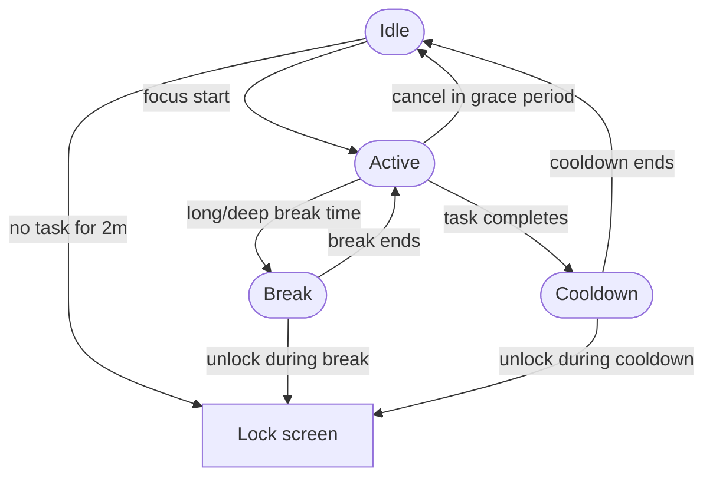

# Focus

Focus is a productivity tool designed to keep your computer usage intentional. It helps you stay on track and manage your time effectively, ensuring every session at your desk has a clear purpose rather than drifting into aimless browsing.

The system operates via a background daemon (`focusd`) that handles time tracking, while a simple CLI (`focus`) provides the interface for managing your work.

Project site: [focus.krabhi.me](https://focus.krabhi.me)

Current runtime model:

- `cmd/daemon/runtime.go` owns lifecycle timers and side effects.
- `internal/core` owns phase/deadline transitions (`idle`, `active`, `break`, `pending_cooldown`, `cooldown`).
- `internal/state` is now config/preset/history/socket support only.

## Rules

- **Intentional Use:** Focus gives you a 2-minute grace period to use your computer without an active task. Beyond that, the system will warn you before locking the screen or putting the computer to sleep.
- **One Thing at a Time:** Only one task can be active at once. When a task finishes, the daemon enforces a cooldown before you can start the next one. Cooldown scales by task length.
- **Work Modes:**
  - **short (15 min):** No in-task break.
  - **medium (30 min):** No in-task break.
  - **long (60 min):** Break starts at 25 minutes for 5 minutes.
  - **deep (90 min):** Break starts at 45 minutes for 10 minutes.
- **Break Enforcement (long/deep only):**
  - You get a reminder 2 minutes before the break starts.
  - At break start, Focus locks the screen.
  - If the screen is unlocked during break or cooldown, Focus warns once and relocks after the configured `relock_delay`.
- **Post-Task Cooldown:** Cooldown starts only after task completion (not during the in-task break).
- **Automatic Tracking:** There is no need for manual toggling. Focus monitors your keyboard, mouse, and screen activity to automatically pause and resume tasks whenever you step away.
- **Heads-up Notifications:** You’ll receive a notification 5 minutes before a task ends, giving you time to wrap up your work gracefully.
- **Status Visibility:** `focus status` shows cooldown state, active task remaining time, and break-specific details including relock countdown when applicable.

## State Machine



`Idle` means no task is running and no cooldown is active. `Break` only applies to long and deep tasks. If the user unlocks during break or cooldown, Focus relocks after `relock_delay`. Screen locking is an action, not a separate state.

## System Requirements

For now this is only available in Linux and tested with cinnamon desktop environment. It should work in other environments as well, but I haven't tested it yet.

Runtime dependencies used by `focusd`:

- `xdg-screensaver` for screen lock
- `notify-send` for desktop notifications
- `paplay` for task-ending sound (`assets/task-ending.mp3`)
- `focus-events` helper binary (installed alongside `focusd`)

Environment-specific notes:

- `cinnamon-screensaver-command` is used for unlock action (currently not part of normal user flow).
- `systemctl --user` is needed only if you use the user service install path.

Runtime observability:

- Set `FOCUS_TRACE_FLOW=1` to log runtime flow actions and core events.

## Run

Build everything with:

```bash
make build
```

Run the daemon and client from the built binaries:

```bash
./dist/focusd
./dist/focus status
./dist/focus history
```

## Useful Commands

- `focus status` shows the current task, cooldown, or break state.
- `focus reload` reloads daemon configuration from disk.
- `focus doctor` prints dependency, socket, daemon IPC, and service health checks.
- `focus version` prints the installed binary version.
- `focus update` upgrades to the latest release.
- `focus update --version v0.1.4` upgrades to a specific release.
- `focus uninstall` removes the installed binaries and user service.
- `systemctl --user status focusd.service` checks whether the daemon service is running.

Avoid running `go run cmd/daemon/main.go` directly. Use the package path instead if you want to run from source:

```bash
go run ./cmd/daemon
go run ./cmd/client status
```

## Install (user systemd service)

Install latest release (GitHub):

```bash
curl -fsSL https://raw.githubusercontent.com/krabhi1/focus/main/install.sh | sh
```

Install a specific version:

```bash
curl -fsSL https://raw.githubusercontent.com/krabhi1/focus/main/install.sh | sh -s -- --version v0.1.0
```

Manual (recommended for audit): download `install.sh`, review it, then run it.

Install from local source checkout:

```bash
./scripts/install.sh
```

This installs:

- `focus`, `focusd`, and `focus-events` to `~/.local/bin` (by default)
- sound assets to `~/.local/share/focus/assets`
- `focusd.service` to `~/.config/systemd/user/focusd.service`

Manage service manually if needed:

```bash
systemctl --user daemon-reload
systemctl --user enable --now focusd.service
systemctl --user status focusd.service
```

Uninstall:

```bash
focus uninstall
```

For a custom install prefix:

```bash
focus uninstall --prefix /custom/prefix
```

Check installed version:

```bash
focus version
```

Update to the latest release:

```bash
focus update
```

Update to a specific release:

```bash
focus update --version v0.1.2
```

For custom installs:

```bash
focus update --prefix /custom/prefix
```

Note: release updates currently target `linux/amd64`, matching the published release assets.

## Configuration

Focus can load runtime settings from JSON config.

Full reference:

- [Config and commands manual](docs/manual.md)

- Default path: `~/.config/focus/config.json`
- Override config path: `FOCUS_CONFIG=/path/to/config.json`

Apply changes without restarting daemon:

```bash
focus reload
```

Optional install flags:

```bash
./scripts/install.sh --prefix /custom/prefix
./scripts/install.sh --no-build
./scripts/install.sh --no-systemd
```

For a source checkout, use:

```bash
./scripts/uninstall.sh
```

Current prebuilt release target: `linux/amd64`.

## Manual Docs

- [Config and commands manual](docs/manual.md)
- [Fast smoke test guide](docs/smoke-test.md)

## Verify release publishing

After pushing a version tag, verify workflow + release assets:

```bash
make check-release VERSION=v0.1.0
```

For private repos, use a token with repo/actions read permissions:

```bash
GITHUB_TOKEN=your_token_here make check-release VERSION=v0.1.0
```

## Release workflow

This repo has a tag-triggered GitHub Actions workflow at:

- `.github/workflows/release.yml`

When a tag matching `v*` is pushed (example: `v0.1.1`), the workflow:

1. Builds release artifacts via `scripts/package-release.sh`.
2. Publishes a GitHub Release.
3. Uploads `focus_<tag>_linux_amd64.tar.gz`.
4. Uploads `checksums_<tag>.txt`.

### Cut a release

```bash
git checkout main
git pull --ff-only
git tag v0.1.1
git push origin main
git push origin v0.1.1
```

### Verify release

```bash
make check-release VERSION=v0.1.1
```

### Verify installer against released tag

```bash
curl -fsSL https://raw.githubusercontent.com/krabhi1/focus/main/install.sh | sh -s -- --version v0.1.1 --no-systemd
```

### Notes

- Current prebuilt target is `linux/amd64`.
- If tag was pushed by mistake, delete it locally and remotely:

```bash
git tag -d v0.1.1
git push origin :refs/tags/v0.1.1
```
